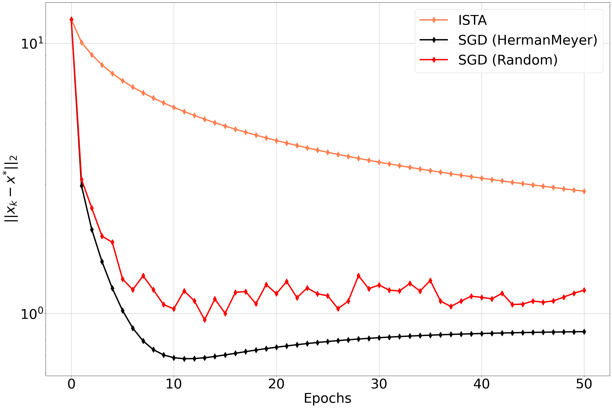
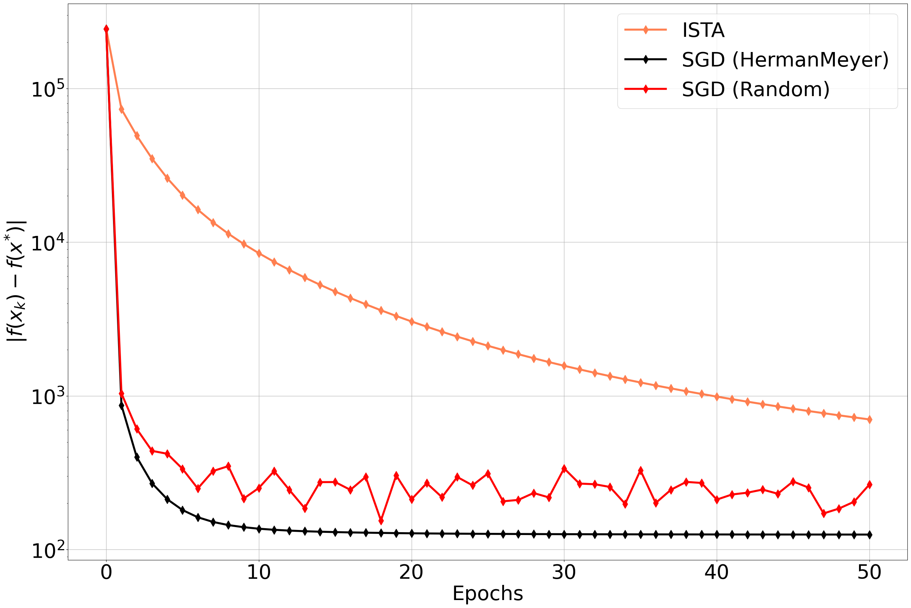
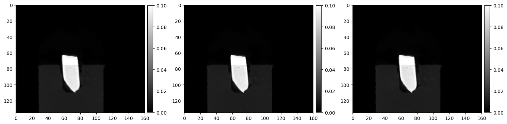

```python
import os
from cil.processors import Binner, TransmissionAbsorptionConverter, Slicer, CentreOfRotationCorrector
from cil.optimisation.utilities import RandomSampling, SequentialSampling, HermanMeyerSampling
from cil.utilities import dataexample
from cil.optimisation.functions import LeastSquares, SGFunction, SAGAFunction
from cil.plugins.astra import ProjectionOperator
from cil.optimisation.algorithms import FISTA, ISTA
from cil.plugins.ccpi_regularisation.functions import FGP_TV
from cil.optimisation.utilities import OptimalityDistance
from cil.utilities.display import show2D

import numpy as np
import matplotlib.pyplot as plt
```

### Read SYNCHROTRON_PARALLEL_BEAM_DATA 


```python
data = dataexample.SYNCHROTRON_PARALLEL_BEAM_DATA.get()
data_raw20 = data.get_slice(vertical=20)
scale = data_raw20.sum()/data_raw20.size
data /= scale
data.log(out=data)
data *= -1
data = CentreOfRotationCorrector.xcorrelation(slice_index='centre')(data)
data = Slicer(roi={'angle':(0,90,None)})(data) # with 91 angles(default), we get 7 and 13 in prime num decom
data.reorder('astra')
```


```python
print("Acquisition Data shape", data.shape)
print("Acquisition Data geometry labels", data.geometry.dimension_labels)
```

    Acquisition Data shape (135, 90, 160)
    Acquisition Data geometry labels ('vertical', 'angle', 'horizontal')


## Deterministic algorithm


```python
alpha = 0.1
ag = data.geometry
ig = ag.get_ImageGeometry()
G = (alpha/ig.voxel_size_x) * FGP_TV(max_iteration = 100, device="gpu") 
A = ProjectionOperator(ig, ag, device = "gpu")
```


```python
initial = ig.allocate()
fidelity = LeastSquares(A, b = data, c = 0.5)
step_size_ista = 1./fidelity.L
ista = ISTA(initial = initial, f=fidelity, step_size = step_size_ista, g=G, update_objective_interval = 100, 
            max_iteration = 500)
ista.run(verbose=1)
```

         Iter   Max Iter     Time/Iter            Objective
                                   [s]                     
            0        500         0.000          2.49390e+05
          100        500         0.202          4.92945e+03
          200        500         0.202          4.75383e+03
          300        500         0.202          4.70568e+03
          400        500         0.202          4.68891e+03
          500        500         0.202          4.68343e+03
    -------------------------------------------------------
          500        500         0.202          4.68343e+03
    Stop criterion has been reached.
    


## HermanMeyerSampling

- https://ieeexplore.ieee.org/document/241889/
- https://ieeexplore.ieee.org/document/563668 (CT)
- https://pubmed.ncbi.nlm.nih.gov/25163058/

### Ordered split Dataset (SequentialSampling) --> Select function (HermanMeyerSampling)


```python
num_subsets = 45
data_split1, method1 = data.split_to_subsets(num_subsets, method= "ordered", info=True)
```

    WARNING:root:Batch size is (constant) self.num_indices//self.num_batches 


```python
method1.show_epochs(1)
```

     Epoch : 0, batches used : [[0, 45], [1, 46], [2, 47], [3, 48], [4, 49], [5, 50], [6, 51], [7, 52], [8, 53], [9, 54], [10, 55], [11, 56], [12, 57], [13, 58], [14, 59], [15, 60], [16, 61], [17, 62], [18, 63], [19, 64], [20, 65], [21, 66], [22, 67], [23, 68], [24, 69], [25, 70], [26, 71], [27, 72], [28, 73], [29, 74], [30, 75], [31, 76], [32, 77], [33, 78], [34, 79], [35, 80], [36, 81], [37, 82], [38, 83], [39, 84], [40, 85], [41, 86], [42, 87], [43, 88], [44, 89]] 


```python
def list_of_functions(data):
    
    list_funcs = []
    ig = data[0].geometry.get_ImageGeometry()
    
    for d in data:
        ageom_subset = d.geometry        
        Ai = ProjectionOperator(ig, ageom_subset, device = 'gpu')    
        fi = LeastSquares(Ai, b = d, c = 0.5)
        list_funcs.append(fi)   
        
    return list_funcs

```


```python
list_func = list_of_functions(data_split1)

selection1 = HermanMeyerSampling(len(list_func), num_subsets)
selection2 = RandomSampling.uniform(len(list_func), num_subsets) # replace=True, shuffle=True

sg_func1 = SGFunction(list_func, selection=selection1)
sg_func2 = SGFunction(list_func, selection=selection2)
```

    WARNING:root:Batch size is (constant) self.num_indices//self.num_batches 


```python
selection1.show_epochs(2)
```

     Epoch : 0, indices used : [0, 15, 30, 5, 20, 35, 10, 25, 40, 1, 16, 31, 6, 21, 36, 11, 26, 41, 2, 17, 32, 7, 22, 37, 12, 27, 42, 3, 18, 33, 8, 23, 38, 13, 28, 43, 4, 19, 34, 9, 24, 39, 14, 29, 44] 
     Epoch : 1, indices used : [0, 15, 30, 5, 20, 35, 10, 25, 40, 1, 16, 31, 6, 21, 36, 11, 26, 41, 2, 17, 32, 7, 22, 37, 12, 27, 42, 3, 18, 33, 8, 23, 38, 13, 28, 43, 4, 19, 34, 9, 24, 39, 14, 29, 44] 
    


```python
selection2.show_epochs(2)
```

     Epoch : 0, indices used : [18, 7, 10, 38, 38, 19, 35, 21, 38, 13, 18, 33, 14, 35, 34, 29, 33, 35, 25, 11, 38, 18, 15, 6, 4, 23, 32, 20, 7, 2, 42, 4, 37, 35, 15, 33, 37, 27, 31, 35, 44, 39, 36, 9, 16] 
     Epoch : 1, indices used : [8, 12, 34, 11, 3, 26, 18, 43, 8, 43, 35, 3, 37, 27, 12, 4, 35, 40, 40, 40, 44, 21, 6, 37, 23, 11, 42, 27, 31, 10, 35, 5, 31, 41, 6, 9, 30, 40, 16, 28, 5, 20, 41, 18, 8] 
    


```python
num_epochs = 50
step_size_ista = 1./sg_func1.L
sgd1 = ISTA(initial = initial, f = sg_func1, step_size = step_size_ista, g=G, 
            update_objective_interval = selection1.num_batches, 
            max_iteration = num_epochs * selection1.num_batches)  
ci = OptimalityDistance(sgd1, ista.solution)
sgd1.run(verbose=1, callback=ci)
```

         Iter   Max Iter     Time/Iter            Objective
                                   [s]                     
            0       2250         0.000          2.49395e+05
           45       2250         0.194          5.55291e+03
           90       2250         0.192          5.08367e+03
          135       2250         0.191          4.95379e+03
          180       2250         0.190          4.89601e+03
          225       2250         0.190          4.86430e+03
          270       2250         0.189          4.84578e+03
          315       2250         0.189          4.83478e+03
          360       2250         0.189          4.82784e+03
          405       2250         0.189          4.82336e+03
          450       2250         0.189          4.82018e+03
          495       2250         0.189          4.81797e+03
          540       2250         0.189          4.81636e+03
          585       2250         0.189          4.81514e+03
          630       2250         0.189          4.81418e+03
          675       2250         0.189          4.81342e+03
          720       2250         0.189          4.81279e+03
          765       2250         0.189          4.81228e+03
          810       2250         0.189          4.81184e+03
          855       2250         0.189          4.81144e+03
          900       2250         0.189          4.81110e+03
          945       2250         0.189          4.81082e+03
          990       2250         0.189          4.81058e+03
         1035       2250         0.189          4.81038e+03
         1080       2250         0.189          4.81019e+03
         1125       2250         0.189          4.81002e+03
         1170       2250         0.189          4.80988e+03
         1215       2250         0.189          4.80974e+03
         1260       2250         0.189          4.80962e+03
         1305       2250         0.189          4.80951e+03
         1350       2250         0.189          4.80942e+03
         1395       2250         0.189          4.80934e+03
         1440       2250         0.189          4.80927e+03
         1485       2250         0.189          4.80920e+03
         1530       2250         0.189          4.80915e+03
         1575       2250         0.189          4.80909e+03
         1620       2250         0.189          4.80904e+03
         1665       2250         0.189          4.80900e+03
         1710       2250         0.189          4.80896e+03
         1755       2250         0.189          4.80892e+03
         1800       2250         0.189          4.80889e+03
         1845       2250         0.189          4.80886e+03
         1890       2250         0.189          4.80884e+03
         1935       2250         0.189          4.80881e+03
         1980       2250         0.189          4.80879e+03
         2025       2250         0.189          4.80877e+03
         2070       2250         0.189          4.80875e+03
         2115       2250         0.189          4.80873e+03
         2160       2250         0.189          4.80872e+03
         2205       2250         0.189          4.80870e+03
         2250       2250         0.189          4.80869e+03
    -------------------------------------------------------
         2250       2250         0.189          4.80869e+03
    Stop criterion has been reached.
    


```python

step_size_ista = 1./sg_func2.L
sgd2 = ISTA(initial = initial, f = sg_func2, step_size = step_size_ista, g=G, 
            update_objective_interval = selection2.num_batches, 
            max_iteration = num_epochs * selection2.num_batches)  
ci = OptimalityDistance(sgd2, ista.solution)
sgd2.run(verbose=1, callback=ci)
```

         Iter   Max Iter     Time/Iter            Objective
                                   [s]                     
            0       2250         0.000          2.49395e+05
           45       2250         0.189          5.72162e+03
           90       2250         0.189          5.29317e+03
          135       2250         0.189          5.12236e+03
          180       2250         0.189          5.10380e+03
          225       2250         0.189          5.01875e+03
          270       2250         0.189          4.93320e+03
          315       2250         0.189          5.00799e+03
          360       2250         0.189          5.03254e+03
          405       2250         0.189          4.89802e+03
          450       2250         0.189          4.93513e+03
          495       2250         0.189          5.00756e+03
          540       2250         0.189          4.92786e+03
          585       2250         0.189          4.86959e+03
          630       2250         0.189          4.95824e+03
          675       2250         0.189          4.95855e+03
          720       2250         0.189          4.92814e+03
          765       2250         0.189          4.98054e+03
          810       2250         0.189          4.83803e+03
          855       2250         0.189          4.98747e+03
          900       2250         0.189          4.89559e+03
          945       2250         0.189          4.95397e+03
          990       2250         0.189          4.90267e+03
         1035       2250         0.189          4.98014e+03
         1080       2250         0.189          4.94535e+03
         1125       2250         0.189          4.99618e+03
         1170       2250         0.189          4.88961e+03
         1215       2250         0.189          4.89398e+03
         1260       2250         0.189          4.91685e+03
         1305       2250         0.189          4.90199e+03
         1350       2250         0.189          5.02101e+03
         1395       2250         0.189          4.95233e+03
         1440       2250         0.189          4.94973e+03
         1485       2250         0.189          4.93908e+03
         1530       2250         0.189          4.88205e+03
         1575       2250         0.189          5.01170e+03
         1620       2250         0.189          4.88450e+03
         1665       2250         0.189          4.92858e+03
         1710       2250         0.189          4.95913e+03
         1755       2250         0.189          4.95490e+03
         1800       2250         0.189          4.89492e+03
         1845       2250         0.189          4.91180e+03
         1890       2250         0.189          4.91798e+03
         1935       2250         0.189          4.92916e+03
         1980       2250         0.189          4.91438e+03
         2025       2250         0.189          4.96102e+03
         2070       2250         0.189          4.93683e+03
         2115       2250         0.189          4.85532e+03
         2160       2250         0.189          4.86825e+03
         2205       2250         0.189          4.88833e+03
         2250       2250         0.189          4.94856e+03
    -------------------------------------------------------
         2250       2250         0.189          4.94856e+03
    Stop criterion has been reached.
    


```python
ista1 = ISTA(initial = initial, f=fidelity, step_size = step_size_ista, g=G, update_objective_interval = 1, 
            max_iteration = num_epochs)
ci = OptimalityDistance(ista1, ista.solution)
ista1.run(verbose=1, callback=ci)
```

         Iter   Max Iter     Time/Iter            Objective
                                   [s]                     
            0         50         0.000          2.49390e+05
            1         50         0.202          7.80979e+04
            2         50         0.203          5.40551e+04
            3         50         0.203          3.97172e+04
            4         50         0.203          3.07748e+04
            5         50         0.203          2.49418e+04
            6         50         0.203          2.09696e+04
            7         50         0.203          1.81435e+04
            8         50         0.203          1.60469e+04
            9         50         0.203          1.44371e+04
           10         50         0.203          1.31653e+04
           11         50         0.203          1.21362e+04
           12         50         0.203          1.12874e+04
           13         50         0.203          1.05767e+04
           14         50         0.203          9.97437e+03
           15         50         0.203          9.45896e+03
           16         50         0.203          9.01449e+03
           17         50         0.203          8.62856e+03
           18         50         0.203          8.29157e+03
           19         50         0.203          7.99577e+03
           20         50         0.203          7.73488e+03
           21         50         0.203          7.50387e+03
           22         50         0.203          7.29847e+03
           23         50         0.203          7.11520e+03
           24         50         0.203          6.95112e+03
           25         50         0.203          6.80382e+03
           26         50         0.203          6.67115e+03
           27         50         0.203          6.55131e+03
           28         50         0.203          6.44275e+03
           29         50         0.203          6.34417e+03
           30         50         0.203          6.25435e+03
           31         50         0.203          6.17236e+03
           32         50         0.203          6.09730e+03
           33         50         0.203          6.02843e+03
           34         50         0.203          5.96509e+03
           35         50         0.203          5.90668e+03
           36         50         0.203          5.85272e+03
           37         50         0.203          5.80279e+03
           38         50         0.203          5.75645e+03
           39         50         0.203          5.71338e+03
           40         50         0.203          5.67328e+03
           41         50         0.203          5.63584e+03
           42         50         0.203          5.60084e+03
           43         50         0.203          5.56807e+03
           44         50         0.203          5.53731e+03
           45         50         0.203          5.50840e+03
           46         50         0.203          5.48118e+03
           47         50         0.203          5.45552e+03
           48         50         0.203          5.43126e+03
           49         50         0.203          5.40832e+03
           50         50         0.203          5.38657e+03
    -------------------------------------------------------
           50         50         0.203          5.38657e+03
    Stop criterion has been reached.
    


```python
import matplotlib.pyplot as plt
import matplotlib as mpl
mpl.rcParams['lines.linewidth'] = 4
mpl.rcParams['lines.markersize'] = 12

plt.figure(figsize=(30,20))
plt.semilogy([l for l in ista1.optimality_distance], label="ISTA", color="coral", marker="d")
plt.semilogy([l for l in sgd1.optimality_distance], label="SGD (HermanMeyer)", color="black", marker="d")
plt.semilogy([l for l in sgd2.optimality_distance], label="SGD (Random)", color="red", marker="d")
plt.ylabel("$||x_{k} - x^{*}||_{2}$",fontsize=40)
plt.xlabel("Epochs", fontsize=40)
plt.tick_params(axis='x',  labelsize=40)
plt.tick_params(axis='y',  labelsize=40)
plt.legend(loc='upper right', prop={'size': 40})
plt.grid()
plt.show()

plt.figure(figsize=(30,20))
plt.semilogy([np.abs(l-ista.objective[-1]) for l in ista1.objective], label="ISTA", color="coral", marker="d")
plt.semilogy([np.abs(l-ista.objective[-1]) for l in sgd1.objective], label="SGD (HermanMeyer)", color="black", marker="d")
plt.semilogy([np.abs(l-ista.objective[-1]) for l in sgd2.objective], label="SGD (Random)", color="red", marker="d")
plt.ylabel("$|f(x_{k}) - f(x^{*})|$",fontsize=40)
plt.xlabel("Epochs", fontsize=40)
plt.tick_params(axis='x',  labelsize=40)
plt.tick_params(axis='y',  labelsize=40)
plt.legend(loc='upper right', prop={'size': 40})
plt.grid()
plt.show()
```


    

    


    

    


```python
show2D([ista.solution.array[:,70], sgd1.solution.array[:,70], sgd2.solution.array[:,70]], 
       origin="upper", cmap="gray", 
       num_cols=3, fix_range=(0,0.1))
```


    

    


    <cil.utilities.display.show2D at 0x7f539e2e08b0>


