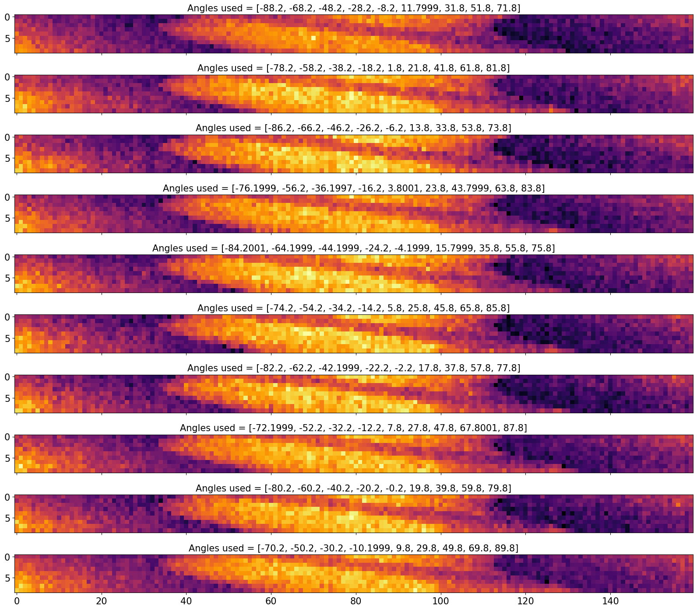

```python
import os
from cil.processors import Binner, TransmissionAbsorptionConverter, Slicer, CentreOfRotationCorrector
from cil.optimisation.utilities import RandomSampling, SequentialSampling, HermanMeyerSampling
from cil.utilities import dataexample

import numpy as np
import matplotlib.pyplot as plt
from mpl_toolkits.axes_grid1 import AxesGrid
from mpl_toolkits.axes_grid1.anchored_artists import AnchoredSizeBar
```


```python
data = dataexample.SYNCHROTRON_PARALLEL_BEAM_DATA.get()
data_raw20 = data.get_slice(vertical=20)
scale = data_raw20.sum()/data_raw20.size
data /= scale
data.log(out=data)
data *= -1
data = CentreOfRotationCorrector.xcorrelation(slice_index='centre')(data)
data = Slicer(roi={'angle':(0,90,None)})(data) # with 91 angles(default), we get 7 and 13 in prime num decom
data.reorder('astra')
```


```python
data_split, method = data.split_to_subsets(10, method = "herman_meyer", info=True)
method.show_epochs(1)
```

     Epoch : 0, batches used : [[0, 10, 20, 30, 40, 50, 60, 70, 80], [5, 15, 25, 35, 45, 55, 65, 75, 85], [1, 11, 21, 31, 41, 51, 61, 71, 81], [6, 16, 26, 36, 46, 56, 66, 76, 86], [2, 12, 22, 32, 42, 52, 62, 72, 82], [7, 17, 27, 37, 47, 57, 67, 77, 87], [3, 13, 23, 33, 43, 53, 63, 73, 83], [8, 18, 28, 38, 48, 58, 68, 78, 88], [4, 14, 24, 34, 44, 54, 64, 74, 84], [9, 19, 29, 39, 49, 59, 69, 79, 89]] 


```python
print("Number of subsets = {}".format(method.num_batches))

for i,k in enumerate(method.partition_list):
    print("Subset {} : {}\n".format(i,k))

for i,k in enumerate(data_split):
    print("Subset {} : Angles used = {}\n".format(i,list(k.geometry.angles)))
    
    
slice_ind = 50

plt.rcParams['xtick.labelsize']=15
plt.rcParams['ytick.labelsize']=15

fig = plt.figure(figsize=(20, 20)) 
grid = AxesGrid(fig, 111,
                nrows_ncols=(method.num_batches, 1),
                axes_pad=0.5
                )
k = 0
for ax in grid:    
    ax.imshow(data_split[k].array[slice_ind], cmap="inferno")
    ax.set_title("Angles used = {}".format(list(data_split[k].geometry.angles)),fontsize=15)    
    k+=1    
plt.show()

```

    Number of subsets = 10
    Subset 0 : [0, 10, 20, 30, 40, 50, 60, 70, 80]
    
    Subset 1 : [5, 15, 25, 35, 45, 55, 65, 75, 85]
    
    Subset 2 : [1, 11, 21, 31, 41, 51, 61, 71, 81]
    
    Subset 3 : [6, 16, 26, 36, 46, 56, 66, 76, 86]
    
    Subset 4 : [2, 12, 22, 32, 42, 52, 62, 72, 82]
    
    Subset 5 : [7, 17, 27, 37, 47, 57, 67, 77, 87]
    
    Subset 6 : [3, 13, 23, 33, 43, 53, 63, 73, 83]
    
    Subset 7 : [8, 18, 28, 38, 48, 58, 68, 78, 88]
    
    Subset 8 : [4, 14, 24, 34, 44, 54, 64, 74, 84]
    
    Subset 9 : [9, 19, 29, 39, 49, 59, 69, 79, 89]
    
    Subset 0 : Angles used = [-88.2, -68.2, -48.2, -28.2, -8.2, 11.7999, 31.8, 51.8, 71.8]
    
    Subset 1 : Angles used = [-78.2, -58.2, -38.2, -18.2, 1.8, 21.8, 41.8, 61.8, 81.8]
    
    Subset 2 : Angles used = [-86.2, -66.2, -46.2, -26.2, -6.2, 13.8, 33.8, 53.8, 73.8]
    
    Subset 3 : Angles used = [-76.1999, -56.2, -36.1997, -16.2, 3.8001, 23.8, 43.7999, 63.8, 83.8]
    
    Subset 4 : Angles used = [-84.2001, -64.1999, -44.1999, -24.2, -4.1999, 15.7999, 35.8, 55.8, 75.8]
    
    Subset 5 : Angles used = [-74.2, -54.2, -34.2, -14.2, 5.8, 25.8, 45.8, 65.8, 85.8]
    
    Subset 6 : Angles used = [-82.2, -62.2, -42.1999, -22.2, -2.2, 17.8, 37.8, 57.8, 77.8]
    
    Subset 7 : Angles used = [-72.1999, -52.2, -32.2, -12.2, 7.8, 27.8, 47.8, 67.8001, 87.8]
    
    Subset 8 : Angles used = [-80.2, -60.2, -40.2, -20.2, -0.2, 19.8, 39.8, 59.8, 79.8]
    
    Subset 9 : Angles used = [-70.2, -50.2, -30.2, -10.1999, 9.8, 29.8, 49.8, 69.8, 89.8]
    


    

    

