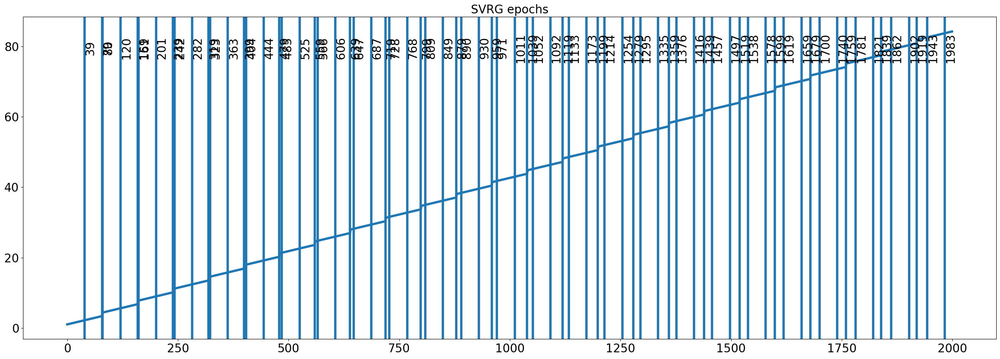
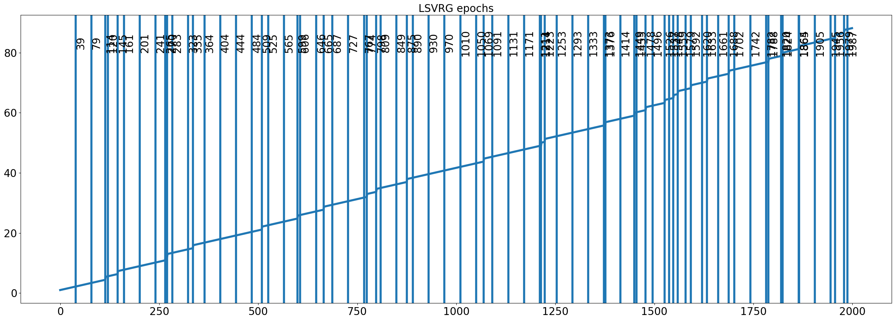
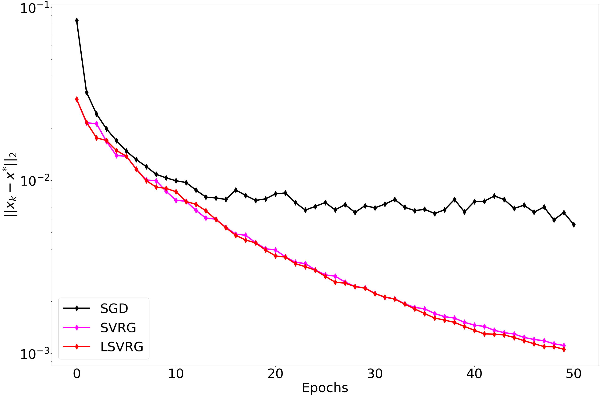
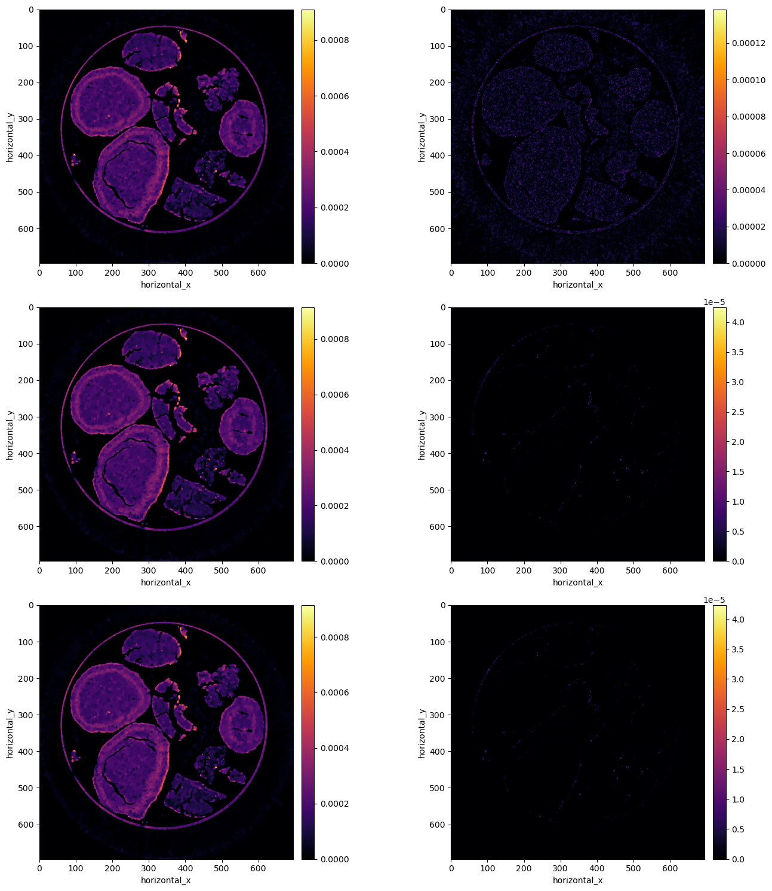

```python
## import libraries
import h5py
import numpy as np
from PIL import Image
import glob
import time
import matplotlib.pyplot as plt
import logging
from cil.utilities.display import show2D
from cil.recon import FDK
import os
import imageio
from cil.framework import AcquisitionGeometry, ImageGeometry
from cil.plugins.astra import FBP, ProjectionOperator
from cil.utilities.jupyter import islicer
from cil.optimisation.algorithms import PDHG, FISTA, ISTA, SPDHG
from cil.optimisation.utilities import RandomSampling
from cil.optimisation.functions import L2NormSquared, LeastSquares, SGFunction, SAGAFunction, BlockFunction
from cil.optimisation.operators import BlockOperator
from cil.plugins.ccpi_regularisation.functions import FGP_TV
from cil.processors import TransmissionAbsorptionConverter
import zarr
import dask
from scipy.fftpack import fftshift, ifftshift, fft, ifft
from cil.optimisation.utilities import OptimalityDistance
import pywt
import numpy.matlib
from ProxSkip import ProxSkip
from SVRGFunction import SVRGFunction
```

## Load Dataset


```python
sino = zarr.load("NiPd_spent_01_microct_rings_removed.zarr")
```


```python
vertical , num_angles, horizontal = sino.shape
```


```python
angles_list = np.linspace(0, np.pi, num_angles)
ag = AcquisitionGeometry.create_Parallel3D().\
        set_panel([horizontal,vertical]).\
        set_angles(angles_list, angle_unit="radian").\
        set_labels(['vertical','angle','horizontal'])
ig = ag.get_ImageGeometry()
ag.shape
```


    (700, 800, 695)


```python
sino_cil = ag.allocate()
sino_cil.fill(sino)
```

## Get 2D slice 


```python
data2D = sino_cil.get_slice(vertical=350)
ag2D = data2D.geometry
ig2D = ag2D.get_ImageGeometry()
```

## Fix Denoiser (PnP)


```python
alpha = 0.3
G = alpha * FGP_TV(max_iteration = 50, device="gpu") 
```

## Num epochs


```python
num_epochs = 50
```

## Solve with FISTA --> optimal solution


```python
A = ProjectionOperator(ig2D, ag2D, device="gpu")

fidelity = LeastSquares(A=A, b=data2D, c=0.5)
step_size_fista = 1./fidelity.L
initial = ig2D.allocate()
```


```python
fista = FISTA(initial = initial, f = fidelity, step_size = step_size_fista, g=G, 
            update_objective_interval = 100, 
            max_iteration = 1000) 
fista.run(verbose=1)

```

         Iter   Max Iter     Time/Iter            Objective
                                   [s]                     
            0       1000         0.000          8.17946e+02
          100       1000         0.099          2.77418e+01
          200       1000         0.101          2.77402e+01
          300       1000         0.102          2.77402e+01
          400       1000         0.103          2.77401e+01
          500       1000         0.103          2.77401e+01
          600       1000         0.103          2.77401e+01
          700       1000         0.103          2.77401e+01
          800       1000         0.104          2.77401e+01
          900       1000         0.104          2.77401e+01
         1000       1000         0.104          2.77401e+01
    -------------------------------------------------------
         1000       1000         0.104          2.77401e+01
    Stop criterion has been reached.
    


## Stochastic Optimisation with (L)SVRG (PnP Stochastic estimators)


```python
num_subsets = 40
data_split1, method1 = data2D.split_to_subsets(num_subsets, method= "ordered", info=True)
```

    WARNING:root:Batch size is (constant) self.num_indices//self.num_batches 


```python
def list_of_functions(data):
    
    list_funcs = []
    ig = data[0].geometry.get_ImageGeometry()
    
    for d in data:
        ageom_subset = d.geometry        
        Ai = ProjectionOperator(ig, ageom_subset, device = 'gpu')    
        fi = LeastSquares(Ai, b = d, c = 0.5)
        list_funcs.append(fi)   
        
    return list_funcs

list_func = list_of_functions(data_split1)

selection1 = RandomSampling(len(list_func), num_subsets, seed=40)
```

    WARNING:root:Batch size is (constant) self.num_indices//self.num_batches 


## SGD


```python
sg_func = SGFunction(list_func, selection1)
step_size_sgd = 1.5e-6

sgd = ISTA(initial = initial, f = sg_func, step_size = step_size_sgd, g=G, 
            update_objective_interval = num_subsets, 
            max_iteration = num_epochs * num_subsets) 
ci = OptimalityDistance(sgd, fista.solution)
sgd.run(verbose=1, callback=ci)

```

         Iter   Max Iter     Time/Iter            Objective
                                   [s]                     
            0       2000         0.000          8.17946e+02
           40       2000         0.055          3.19902e+01
           80       2000         0.057          2.94741e+01
          120       2000         0.057          2.87830e+01
          160       2000         0.058          2.85152e+01
          200       2000         0.059          2.83464e+01
          240       2000         0.059          2.82596e+01
          280       2000         0.059          2.82735e+01
          320       2000         0.059          2.81646e+01
          360       2000         0.059          2.82106e+01
          400       2000         0.059          2.81959e+01
          440       2000         0.059          2.81674e+01
          480       2000         0.059          2.81890e+01
          520       2000         0.059          2.80809e+01
          560       2000         0.059          2.81103e+01
          600       2000         0.059          2.80947e+01
          640       2000         0.059          2.82119e+01
          680       2000         0.059          2.81860e+01
          720       2000         0.059          2.81007e+01
          760       2000         0.059          2.81364e+01
          800       2000         0.059          2.81848e+01
          840       2000         0.059          2.82229e+01
          880       2000         0.059          2.81387e+01
          920       2000         0.059          2.80822e+01
          960       2000         0.059          2.81129e+01
         1000       2000         0.059          2.81210e+01
         1040       2000         0.059          2.80650e+01
         1080       2000         0.059          2.81453e+01
         1120       2000         0.059          2.80664e+01
         1160       2000         0.059          2.81255e+01
         1200       2000         0.059          2.81076e+01
         1240       2000         0.059          2.81641e+01
         1280       2000         0.059          2.81643e+01
         1320       2000         0.059          2.80991e+01
         1360       2000         0.059          2.80724e+01
         1400       2000         0.059          2.81304e+01
         1440       2000         0.059          2.80624e+01
         1480       2000         0.059          2.80888e+01
         1520       2000         0.059          2.81576e+01
         1560       2000         0.059          2.80766e+01
         1600       2000         0.059          2.81542e+01
         1640       2000         0.059          2.81246e+01
         1680       2000         0.059          2.82049e+01
         1720       2000         0.059          2.81470e+01
         1760       2000         0.059          2.80692e+01
         1800       2000         0.059          2.80931e+01
         1840       2000         0.059          2.80884e+01
         1880       2000         0.059          2.81432e+01
         1920       2000         0.059          2.80522e+01
         1960       2000         0.059          2.80721e+01
         2000       2000         0.059          2.80207e+01
    -------------------------------------------------------
         2000       2000         0.059          2.80207e+01
    Stop criterion has been reached.
    


## SVRG


```python
svrg_func = SVRGFunction(list_func, selection1, update_frequency = 2, loopless=False)
step_size_svrg = 1./(np.sum([list_func[0].L]*num_subsets))

svrg = ISTA(initial = initial, f = svrg_func, step_size = step_size_svrg, g=G, 
            update_objective_interval = 1,
            max_iteration = num_epochs * num_subsets)  
ci = OptimalityDistance(svrg, fista.solution)
svrg.run(verbose=0, callback=ci)
```


```python
# should be a callback based on data_passes
def svrg_its_to_epochs(lst):
    
    count = 0
    its_to_epochs = []
    
    for i in range(len(lst) - 1):
        diff = round(lst[i + 1] - lst[i],5)
        if diff >= 1.:
            # full gradient eval
            its_to_epochs.append(i)
        else:
            count +=1
            if count%num_subsets==0:
                # expected that we evaluated num_subsets func
                its_to_epochs.append(i)

    return its_to_epochs
                
list_svrg_epochs = svrg_its_to_epochs(svrg_func.data_passes)
```


```python
import matplotlib.pyplot as plt
import matplotlib as mpl
mpl.rcParams['lines.linewidth'] = 4
mpl.rcParams['lines.markersize'] = 12

plt.figure(figsize=(30, 10))
plt.plot(svrg_func.data_passes)

for vl in list_svrg_epochs:
    plt.axvline(x=vl)    
    plt.text(vl, plt.ylim()[1] * 0.9, str(vl), rotation=90, 
             verticalalignment='center', fontsize=20)
plt.xticks(fontsize=20)
plt.yticks(fontsize=20)
plt.title("SVRG epochs", fontsize=20)
plt.show()
    
```


    

    


## L-SVRG


```python
loopless_svrg_func = SVRGFunction(list_func, selection1, update_frequency = 2, 
                                  loopless=True)

lsvrg = ISTA(initial = initial, f = loopless_svrg_func, step_size = step_size_svrg, g=G, 
            update_objective_interval = 1,
            max_iteration = num_epochs * num_subsets)  
ci = OptimalityDistance(lsvrg, fista.solution)
lsvrg.run(verbose=0, callback=ci)
```


```python
list_lsvrg_epochs = svrg_its_to_epochs(loopless_svrg_func.data_passes)

plt.figure(figsize=(30, 10))
plt.plot(loopless_svrg_func.data_passes)

for vl in list_lsvrg_epochs:
    plt.axvline(x=vl)    
    plt.text(vl, plt.ylim()[1] * 0.9, str(vl), rotation=90, 
             verticalalignment='center', fontsize=20)

plt.xticks(fontsize=20)
plt.yticks(fontsize=20)
plt.title("LSVRG epochs", fontsize=20)
plt.show()

```


    

    


```python
import matplotlib.pyplot as plt
import matplotlib as mpl
mpl.rcParams['lines.linewidth'] = 4
mpl.rcParams['lines.markersize'] = 12

plt.figure(figsize=(30,20))
plt.semilogy([l for l in sgd.optimality_distance], label="SGD", color="black", marker="d")
plt.semilogy([svrg.optimality_distance[i] for i in list_svrg_epochs[0:50]], label="SVRG", color="magenta", marker="d")
plt.semilogy([lsvrg.optimality_distance[i] for i in list_lsvrg_epochs[0:50]], label="LSVRG", color="red", marker="d")
plt.ylabel("$||x_{k} - x^{*}||_{2}$",fontsize=40)
plt.xlabel("Epochs", fontsize=40)
plt.tick_params(axis='x',  labelsize=40)
plt.tick_params(axis='y',  labelsize=40)
plt.legend(loc='lower left', prop={'size': 40})
plt.show()
```


    

    


```python
show2D([sgd.solution, (sgd.solution-fista.solution).abs(),
        svrg.solution, (svrg.solution-fista.solution).abs(),
        lsvrg.solution, (lsvrg.solution-fista.solution).abs()], num_cols=2, cmap="inferno", origin="upper")
```


    

    


    <cil.utilities.display.show2D at 0x7f4b701556f0>


